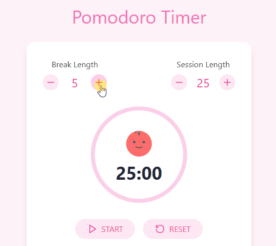
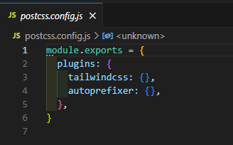
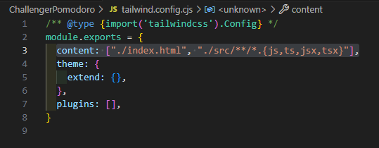
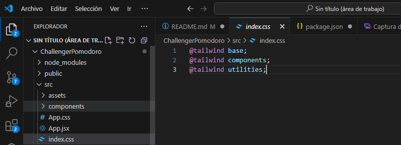
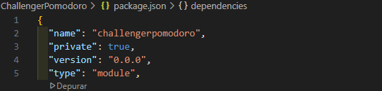
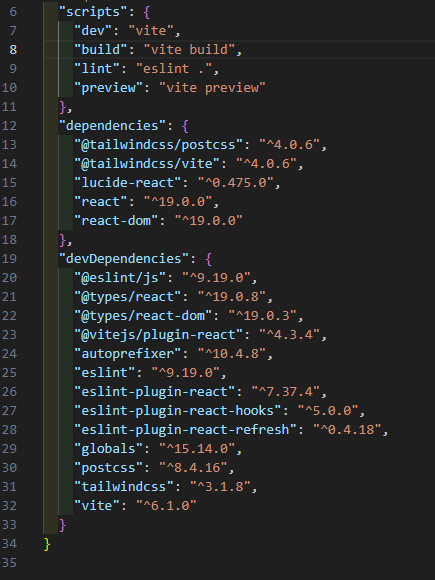

<h1 align="center">Welcome to Pomodoro Watch 👋</h1>

> El inventor de esta técnica fue Francesco Cirillo, un estudiante italiano que se dio cuenta de lo improductivas que eran no solo sus sesiones de estudio, si no las de todos sus compañeros en general.
>
> La técnica Pomodoro, o método Pomodoro, es una herramienta tanto de estudio como de trabajo. De hecho, como forma más precisa de definición, podemos decir que es una metodología de productividad.

>La base de esta técnica consiste en dividir el tiempo en periodos de 25 minutos. Ni un minuto más, ni un minuto menos. ¿Por qué? Porque lo que se busca con esta técnica es alcanzar lo que se llama el “foco de concentración“: ese estado de focus en el cual solo estás centrado en acabar esa tarea que tienes entre manos, sin distracciones de ningún tipo. 
>
> Fuente: Instituto Europeo de Postgrado
> https://iep.edu.es/que-es-el-metodo-pomodoro/
> 

## ✨ Demo

Se usan dos parámetros, el tiempo de trabajo en flow o concentración y el tiempo de descanso

## ⚙️ Install
Se usa la herramienta Vite en su ultima versión LTS 5, y con la biblioteca REACT v5 usando, desde el CLI se ejecuta:  

$ npm create vite@latest my-react-app -- --template react  

$ npm install npx  

Posteriormente se instala tailwindcss en sus versiones especificas colocandp --save-dev para que se guarde en las dependencias  

$ npm install --save-dev lucide-react  
$ npm install --save-dev tailwindcss@3.1.8  
$ npm install --save-dev autoprefixer@10.4.8  
$ npm install --save-dev postcss@8.4.16  

Posteriormente ejecutamos desde el CLI:  
npx tailwindcss init -p  
Al ejecutarse la sentencia anterior se crean dos archivos:  

Created Tailwind CSS config file: tailwind.config.js  
Created PostCSS config file: postcss.config.js  

Inicialmente se muestra sin rutas que usaría Tailwindcss

 

Asignamos las rutas de los archivos que usarán tailwindcss:  
content: ["./index.html", "./src/**/*.{js,ts,jsx,tsx}"],  

Finalmente quedaría de estar forma:  

El archivo main.jsx apunta a index.css, indicamos que index.css usará tailwinddcss colocando las siguientes rutas:  

@tailwind base;  
@tailwind components;  
@tailwind utilities;  

  

## 🚀 Dependencies

Se utiliza las siguintes versiones las cuales son indispensables por compatibilidad:  

- tailwindcss": "^3.1.8"  
- postcss": "^8.4.16"  
- autoprefixer": "^10.4.8"  

## Code Contributors  👑

This project exists thanks to all the people who contribute. 

  

## Author

👤 **Christian Castro Pazmiño**

- Github: [@Soldierchris](https://github.com/Soldierchris)
- Instagram: [@Soldierchriscl](https://www.instagram.com/soldierchriscl)

## 📝 License

Copyright © 2025 [Christian Castro Pazmiño](https://github.com/kefranabg). 
This project is [MIT](https://github.com/kefranabg/readme-md-generator/blob/master/LICENSE) licensed.

