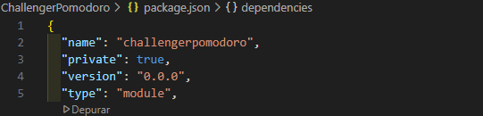

<h1 align="center">Welcome to Pomodoro Watch 👋</h1>

> El inventor de esta técnica fue Francesco Cirillo, un estudiante italiano que se dio cuenta de lo improductivas que eran no solo sus sesiones de estudio, si no las de todos sus compañeros en general.
>
> La técnica Pomodoro, o método Pomodoro, es una herramienta tanto de estudio como de trabajo. De hecho, como forma más precisa de definición, podemos decir que es una metodología de productividad.

>La base de esta técnica consiste en dividir el tiempo en periodos de 25 minutos. Ni un minuto más, ni un minuto menos. ¿Por qué? Porque lo que se busca con esta técnica es alcanzar lo que se llama el “foco de concentración“: ese estado de focus en el cual solo estás centrado en acabar esa tarea que tienes entre manos, sin distracciones de ningún tipo. 
>
> Fuente: Instituto Europeo de Postgrado
> https://iep.edu.es/que-es-el-metodo-pomodoro/
> 

## ✨ Demo

`readme-md-generator` is able to read your environment (package.json, git config...) to suggest you default answers during the `README.md` creation process:

  

Generated `README.md`:

  

## 🚀 Vite

## 🚀 React

## 🚀 Dependencies

Se utiliza las siguintes versiones las cuales son indispensables por compatibilidad :
- postcss": "^8.4.16"
- tailwindcss": "^3.1.8"
- autoprefixer": "^10.4.8"

## Code Contributors

This project exists thanks to all the people who contribute. [[Contribute](CONTRIBUTING.md)].

## Congratulations

Support this project with your organization. Your logo will show up here with a link to your website. [[Contribute](https://opencollective.com/readme-md-generator/contribute)]

## 🤝 Contributing

Contributions, issues and feature requests are welcome. 
Feel free to check [issues page](https://github.com/kefranabg/readme-md-generator/issues) if you want to contribute. 
[Check the contributing guide](./CONTRIBUTING.md). 

## Author

👤 **Christian Castro Pazmiño***

- Github: [@kefranabg](https://github.com/kefranabg)
- Instagram: [@FranckAbgrall](https://twitter.com/FranckAbgrall)
## Show your support

Please ⭐️ this repository if this project helped you!

## 📝 License

Copyright © 2025 [Christian Castro Pazmiño](https://github.com/kefranabg). 
This project is [MIT](https://github.com/kefranabg/readme-md-generator/blob/master/LICENSE) licensed.

