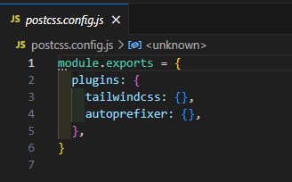
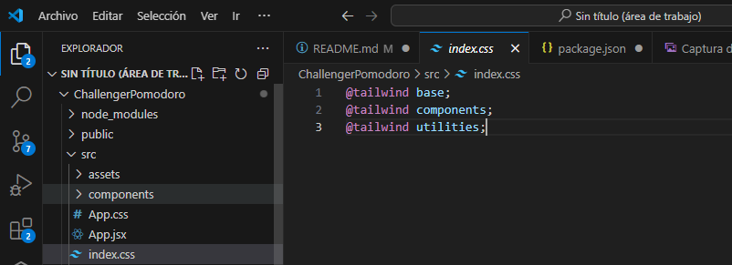
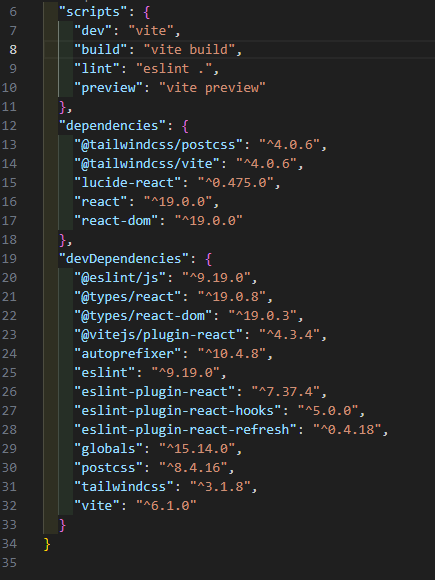

<h1 align="center">Welcome to Pomodoro Watch 👋</h1>

> The inventor of this technique was Francesco Cirillo, an Italian student who realized how unproductive not only his study sessions were, but those of all his classmates in general.
>
> The Pomodoro technique, or Pomodoro method, is a tool for both study and work. In fact, as a more precise way of definition, we can say that it is a productivity methodology.

>The basis of this technique is to divide time into periods of 25 minutes. Not a minute more, not a minute less. Because? Because what is sought with this technique is to achieve what is called the “focus of concentration”: that state of focus in which you are only focused on finishing the task at hand, without distractions of any kind.

> origin: Instituto Europeo de Postgrado
> https://iep.edu.es/que-es-el-metodo-pomodoro/
> 

## ✨ Demo

Two parameters are used, the work time in flow or concentration and the rest time.

## ⚙️ Install
Later, tailwindcss is installed in its specific versions, placing dp --save-dev so that it is saved in the dependencies  

$ npm create vite@latest my-react-app -- --template react  

$ npm install npx  

Later, tailwindcss is installed in its specific versions, placing dp --save-dev so that it is saved in the dependencies  

$ npm install --save-dev lucide-react  
$ npm install --save-dev tailwindcss@3.1.8  
$ npm install --save-dev autoprefixer@10.4.8  
$ npm install --save-dev postcss@8.4.16  

Later we execute from the CLI:  
npx tailwindcss init -p    
When the previous statement is executed, two files are created:  

Created Tailwind CSS config file: tailwind.config.js  
Created PostCSS config file: postcss.config.js  

Initially shown without routes that Tailwindcss would use  

 

We assign the paths of the files they will use tailwindcss:  
content: ["./index.html", "./src/**/*.{js,ts,jsx,tsx}"],  

Finally it would look like this:  

The main.jsx file points to index.css, we indicate that index.css will use tailwinddcss by placing the following paths:   

@tailwind base;  
@tailwind components;  
@tailwind utilities;  

  

## 🚀 Dependencies

The following versions are used, which are essential for compatibility:  

- tailwindcss": "^3.1.8"  
- postcss": "^8.4.16"  
- autoprefixer": "^10.4.8"  

## Code Contributors  👑

This project exists thanks to all the people who contribute. 

  

## Author

👤 **Christian Castro Pazmiño**

- Github: [@Soldierchris](https://github.com/Soldierchris)
- Instagram: [@Soldierchriscl](https://www.instagram.com/soldierchriscl)

## 📝 License

Copyright © 2025 [Christian Castro Pazmiño](https://github.com/kefranabg). 
This project is [MIT](https://github.com/kefranabg/readme-md-generator/blob/master/LICENSE) licensed.

